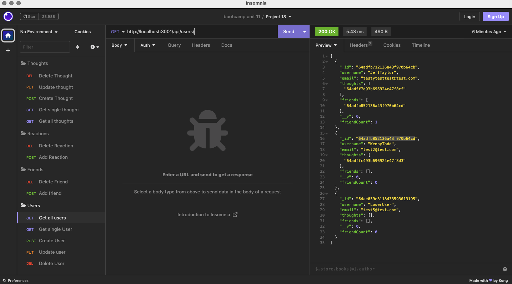

# noSQL-Social-Media-API

[Link to video guide](https://watch.screencastify.com/v/s2W71OrNGimW8Xy6BzBU)

## Description
This app is a back end for a social networking company where you can add delete and update Users, Thoughts, Friends, and Reactions.

## App Screencshot

## Installation

Download or clone the Repo and run npm i in the working directory.

## Usage 
1. Download repo files
2. Open the main directory in the terminal.
3. Run npm i and the run npm start.
4. Use insomnia to test out all of the routes
